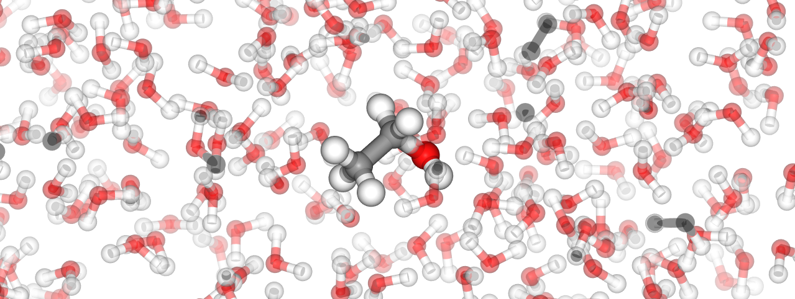
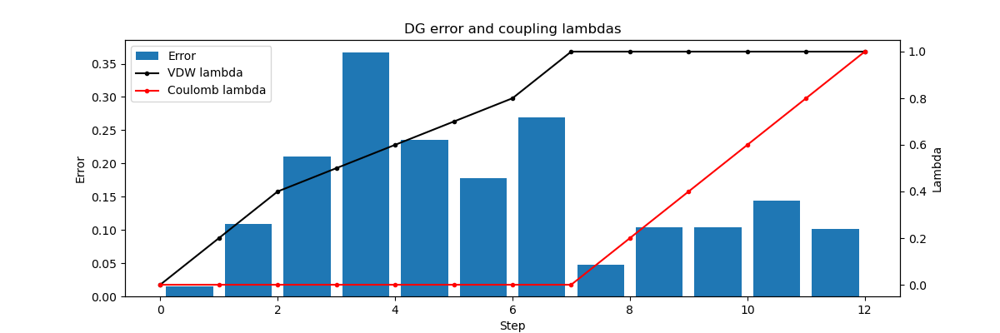

# Ethanol solvation free energy pipeline



Jupyter notebook pipeline to compute the free energy of solvation of
ethanol using alchemical FEP methods and GROMACS.

## Features

- **Automation.** The process from ethanol topology to final simulation
analysis is fully automated.
- **Reproducibility.** GROMACS MD simulations are set up in a fully
reproducible way.
- **Modular design.** The pipeline is easily extandable to other small
molecules.
- **Visualization.** Contribution of each lambda-step's error to the overall
error, energy minimization and molecular structure are visualized.

## Quick start

```sh
conda env create --name ethanol-fep --file ./environment.yml
conda activate ethanol-fep
jupyter notebook main.ipynb
```

## Project structure

```
./
├── README.md          # The README file
├── environment.yml    # Conda environment
├── main.ipynb         # The pipeline script
└── data               # Ethanol molecular structure
```

## Error analysis

The final result is $\Delta{}G = -18.571465\pm{}0.682204$ which is consistent
with experimental $-20.92\pm2.5104$ (taken from
[FreeSolv](https://doi.org/10.1007/s10822-014-9747-x)).

The following plot can be used to analyse which steps contribute most to the
total computation error.


